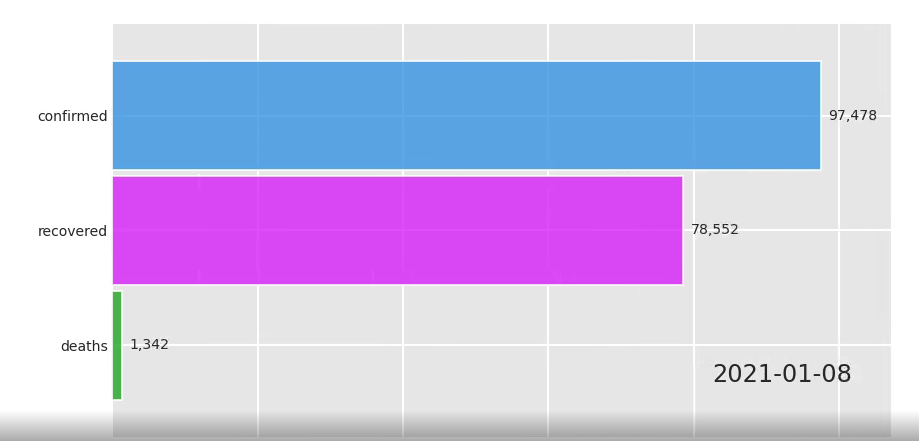

## Covid19: Nigeria's Experience!

The dreaded Covid19 is ravaging the entire world and Nigeria as an active
member of the global community with a very mobile population can't be an exception.
The country had since experienced exponential growth of confirmed cases from
February 27th, 2020 when its first index case, an Italian Engineer, was reported.

The  attached notebook depicts an exploration of the data and an attempt to
predict the growth of confirmed cases using a simple logistic growth model and
facebook's **prophet** package.

### Race Bar Chart of Cases Across States

